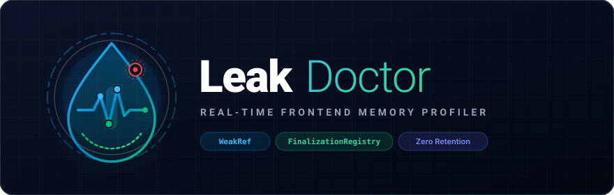
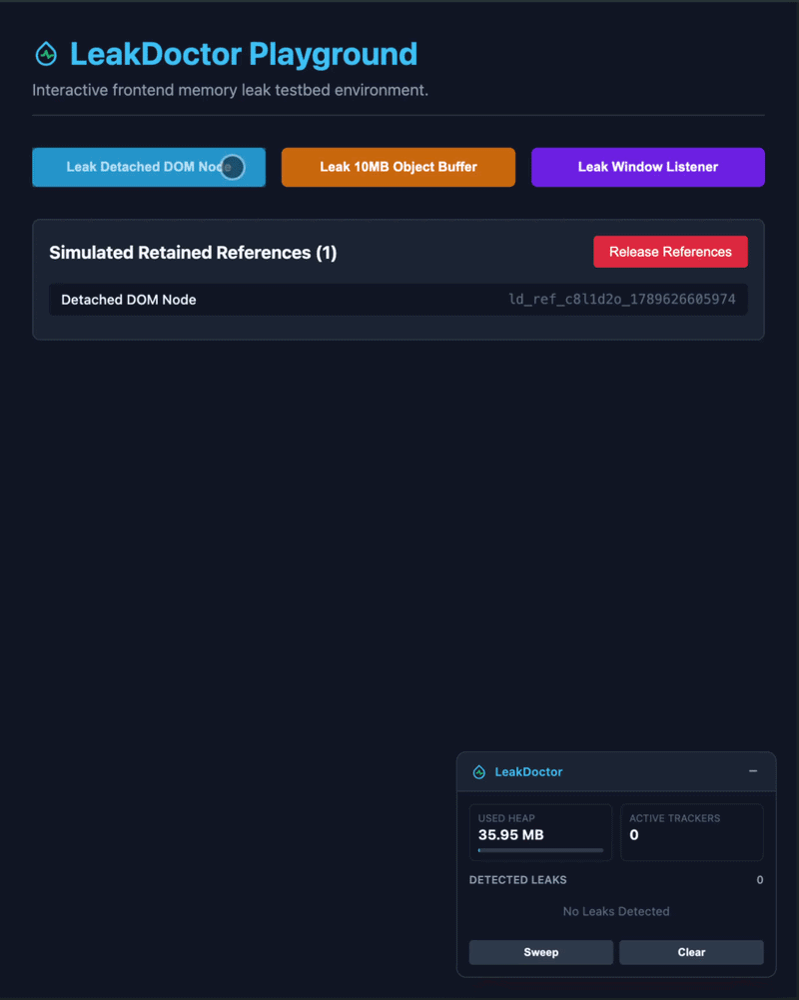
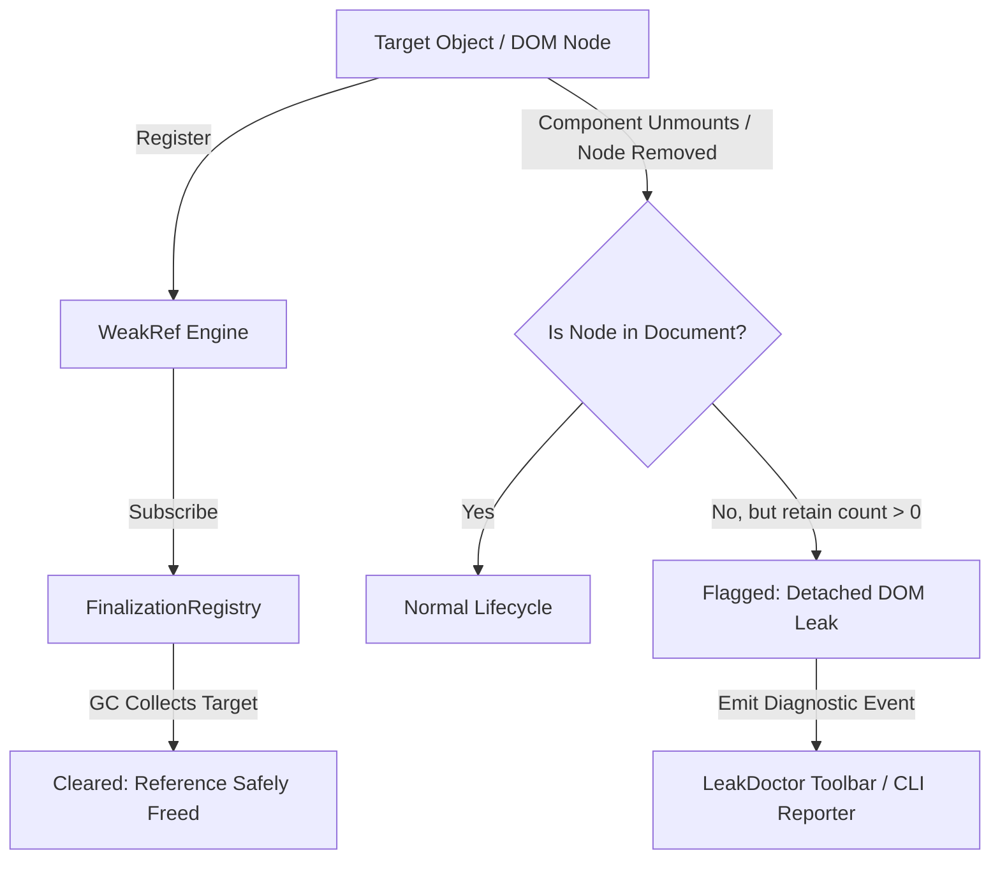

<p align="center">
  
</p>

<p align="center">
  <a href="https://www.npmjs.com/package/@leak-doctor/toolbar"></a>
  <a href="https://bundlephobia.com/package/@leak-doctor/toolbar"></a>
  <a href="https://opensource.org/licenses/MIT"></a>
  <a href="https://turbo.build/repo"></a>
</p>

Chrome DevTools heap snapshots are heavy, manual, and difficult to interpret. LeakDoctor gives you instant feedback while you develop by monitoring detached DOM nodes, retained closures, and orphaned event listeners in the background.

<p align="center">
  
</p>

---

## Live Links

* **Interactive Playground (React 19):** [leak-doctor-playground.vercel.app](https://leak-doctor-playground.vercel.app)
* **Headless Web Scanner (Puppeteer CDP):** [leak-doctor-web.vercel.app](https://leak-doctor-web.vercel.app)

---

## Chrome DevTools vs. LeakDoctor

| Feature | Chrome DevTools Snapshots | LeakDoctor |
| :--- | :--- | :--- |
| **Workflow** | Manual recording, multi-step diffing | Continuous in-browser background monitoring |
| **Snapshot Size** | 50MB - 500MB per snapshot | Zero retention (uses native `WeakRef`) |
| **Feedback Loop** | Post-mortem inspection | Real-time widget notification during interaction |
| **Overhead** | Freezes UI thread during capture | Negligible (`< 10 KB` gzipped, dev-only) |
| **Automation** | Complex Puppeteer scripts | Native headless scanner included |

---

## Quickstart

### 1. Install

```bash
npm install -D @leak-doctor/toolbar
# or
pnpm add -D @leak-doctor/toolbar
```

*(Optional: use `@leak-doctor/profiler` instead if you only require headless tracking without the UI widget).*

### 2. Mount Widget (Development Only)

Add the Shadow DOM toolbar to your application root (e.g., `main.tsx` or `index.ts`):

```typescript
import '@leak-doctor/toolbar';

if (process.env.NODE_ENV === 'development') {
  const toolbar = document.createElement('leak-doctor-toolbar');
  document.body.appendChild(toolbar);
}
```

### 3. Track Suspect Targets

Track DOM elements or heavy in-memory state:

```typescript
import { track, trackElement } from '@leak-doctor/toolbar';

// Track a DOM element for detached node leaks
const element = document.getElementById('user-modal');
if (element) {
  trackElement(element, 'User Modal Component');
}

// Track memory-heavy objects or closures
const buffer = new Array(1000000).fill('Heavy Buffer');
track(buffer, 'Cached Payload');
```

---

## How It Works



1. **Non-Intrusive Observation:** Targets are wrapped in native `WeakRef` instances, preventing the profiler from retaining memory or delaying Garbage Collection.
2. **Lifecycle Notifications:** `FinalizationRegistry` signals when an object is properly reclaimed by the browser engine.
3. **Detached State Checks:** For DOM nodes, the profiler verifies `Node.isConnected`. If detached but uncollected past a configurable threshold, a leak alert is generated.

---

## Workspace Structure

| Package / App | Description | Size / Stack |
| :--- | :--- | :--- |
| **`@leak-doctor/profiler`** | Core tracking engine (`WeakRef`, sweep scheduler) | `< 5 KB` (gzipped), 0 deps |
| **`@leak-doctor/toolbar`** | Web Component diagnostic HUD | `< 5 KB` (gzipped), Shadow DOM |
| **`@leak-doctor/shared`** | Shared TypeScript contracts and formatters | Zero runtime overhead |
| **`apps/playground`** | Interactive leak simulator and testbed | React 19, Vite |
| **`apps/web`** | Automated URL auditor using Chrome DevTools Protocol | Next.js, Puppeteer |

---

## Headless Auditing (CLI / Web)

Test public URLs without modifying client code via the headless auditor:

1. Navigate to [leak-doctor-web.vercel.app](https://leak-doctor-web.vercel.app).
2. Enter the target URL and execute an audit.
3. Inspect the report:
   * **Health Score (0-100):** Memory hygiene evaluation.
   * **Retained Size:** Byte volume uncollected post-forced GC.
   * **DOM Detachments:** Total disconnected nodes retained in memory.

---

## Local Development

```bash
# Clone repository
git clone https://github.com/mmy-lana/leak-doctor.git
cd leak-doctor

# Install dependencies
pnpm install

# Build all packages
pnpm build

# Run playground and web auditor concurrently
pnpm dev
```

* **Playground:** `http://localhost:5173`
* **Web Auditor:** `http://localhost:3000`

---

## Roadmap

- [ ] Chrome DevTools panel extension
- [ ] Automated PR CI/CD assertion action (fail build on heap expansion)
- [ ] Graphical retainer tree path visualizer
- [ ] React hook wrapper (`useLeakDoctor`)

---

## License

Distributed under the [MIT License](LICENSE).
